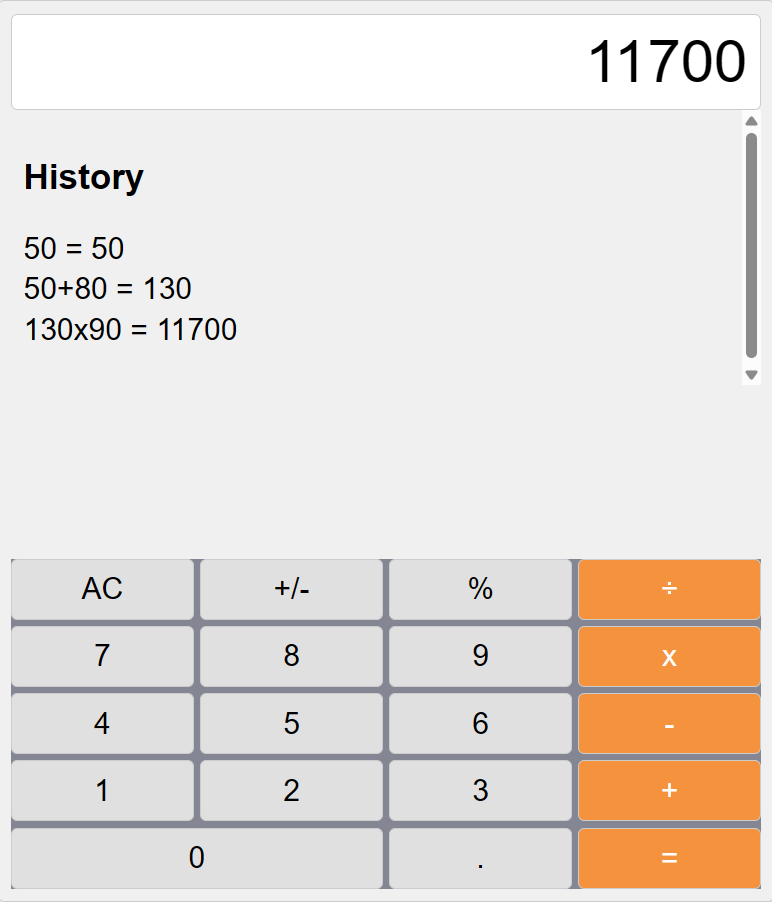
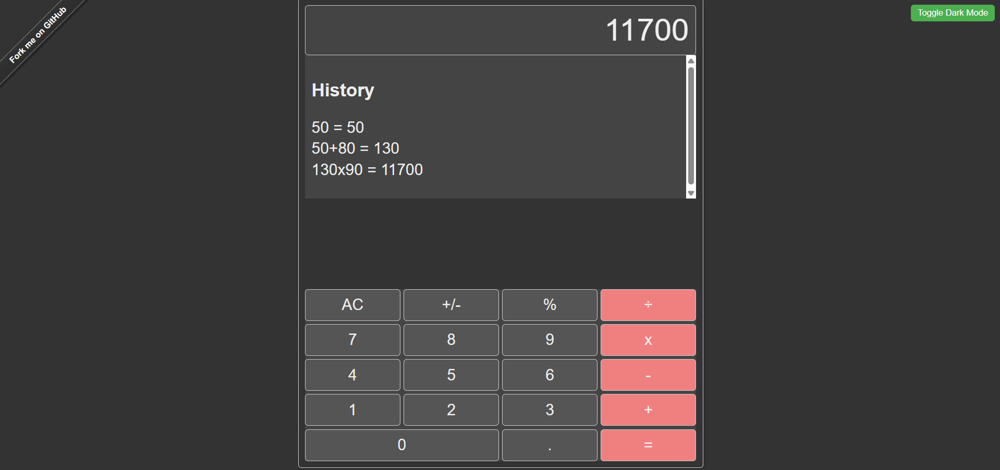

# React Calculator  
*A simple calculator built with React, enhanced using Aider.*  

## 📝 Original Functionality  
- Basic arithmetic operations: addition, subtraction, multiplication, division  
- Responsive button layout  
- Expression validation and error handling  

## ✨ Added Features  
### 1. Calculation History Panel  
- **Description**: Stores and displays past calculations with full expressions (e.g., `1 + 2 = 3`).  
- **How to Use**:  
  - Perform calculations normally.  
  - View history in the right sidebar.  
  - Click "Clear History" to reset.  
- **Screenshot**:  
    

### 2. Keyboard Support  
- **Description**: Use keyboard keys for input (e.g., `0-9`, `+-*/`, `Enter` for equals).  
- **Key Mappings**:  
  | Key       | Action          |  
  |-----------|-----------------|  
  | `0-9`     | Input numbers   |  
  | `+-*/`    | Operators       |  
  | `Enter`   | Calculate       |  
  | `Escape`  | Clear           |  

### 3. Dark Mode Toggle  
- **Description**: Switch between light and dark themes.  
- **Persistence**: Theme preference is saved in `localStorage`.  
- **Screenshot**:  
    

## 🛠️ Implementation Process  
- **Tools Used**: Aider, React, Webpack, Jest  
- **Aider Commands Used**:  
  - `/add` (added files to context)  
  - `/ask` (understand codebase logic)  
  - `/diff` (review changes)  
  - `/run` (test locally)  
  - `/refine` (improve UI/UX)  
  - `/test` (run unit tests)  
  - `/commit` (commit changes)  
- **Challenges**:  
  - Aider initially missed `useState` imports; fixed manually.  
  - Keyboard event handling required refinement for edge cases (e.g., `Backspace`).  

## 📦 Installation  
1. Clone the repo:  
   ```bash  
   git clone https://github.com/zeyadmahfouzz/react-calculator.git   

## 🛠 Fix Node.js OpenSSL Error

If you encounter an OpenSSL-related error with Node.js, set the following environment variable:

```bash
set NODE_OPTIONS=--openssl-legacy-provider    # For Windows
export NODE_OPTIONS=--openssl-legacy-provider # For macOS/Linux
```

## 🚀 Start the App

To start the application, run:

```bash
npm start
```

## 🧪 Testing

Unit tests have been added for:

- **History**
- **Theme toggle**

Run the tests using:

```bash
npm test
```

## 📚 Acknowledgments

Base project forked from [andrewagain/calculator](https://github.com/andrewagain/calculator).  
Enhanced using **Aider**.
